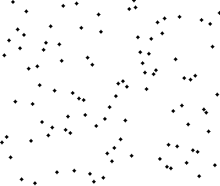
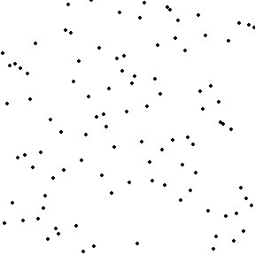
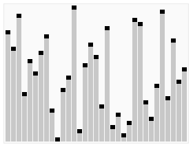
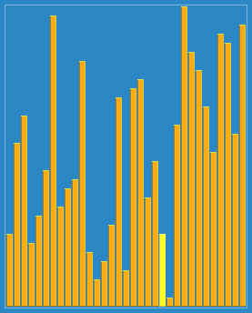
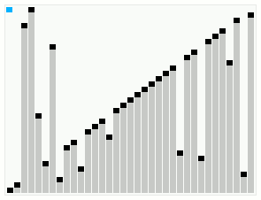
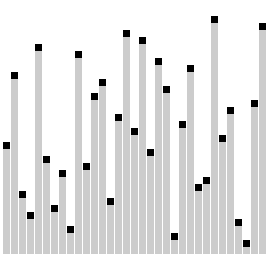
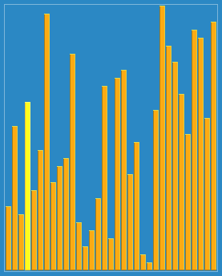
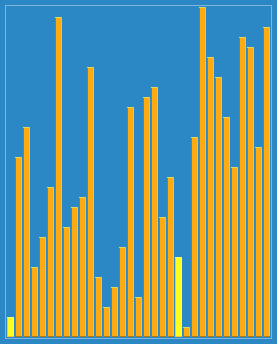
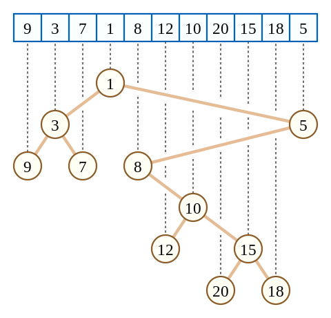
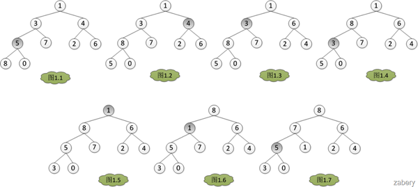

# 排序算法可视化图片集合

这是一个收集了各种经典排序算法可视化动画和图片的项目，用于学习和理解不同排序算法的工作原理。

## 📚 基础排序算法

<details>
<summary>📊 插入排序 (Insertion Sort)</summary>



**特点**：稳定算法，对小规模或几乎有序的数据效率高
</details>

<details>
<summary>📊 选择排序 (Selection Sort)</summary>



**特点**：简单直观，交换次数最少，但效率较低
</details>

## 🚀 高级排序算法

<details>
<summary>⚡ 快速排序 (Quick Sort)</summary>


**特点**：分治算法，平均性能最佳，但不稳定
</details>

<details>
<summary>⚡ 堆排序 (Heap Sort)</summary>



**特点**：原地排序，保证最坏情况性能
</details>

<details>
<summary>⚡ 希尔排序 (Shell Sort)</summary>



**特点**：改进的插入排序，性能优于简单插入排序
</details>

<details>
<summary>⚡ 平滑排序 (Smooth Sort)</summary>



**特点**：堆排序变种，对几乎有序数据表现优秀
</details>

## 🎨 特殊排序算法

<details>
<summary>🔄 梳排序 (Comb Sort)</summary>



**特点**：改进的冒泡排序，消除小尾部的效率问题
</details>

<details>
<summary>🔄 奇偶排序 (Odd-Even Sort)</summary>


**特点**：并行排序算法，适合多处理器环境
</details>

<details>
<summary>🔄 地精排序 (Gnome Sort)</summary>



**特点**：类似插入排序，算法简单但效率较低
</details>

<details>
<summary>🔄 鸡尾酒排序 (Shaker Sort)</summary>


**特点**：双向冒泡排序，某些情况下效率更高
</details>

<details>
<summary>🔄 斯图基排序 (Stooge Sort)</summary>



**特点**：递归排序算法，主要用于教学演示
</details>

## 🏗️ 数据结构可视化

<details>
<summary>🌳 笛卡尔树 (Cartesian Tree)</summary>



**特点**：满足堆性质的二叉搜索树
</details>

<details>
<summary>🌳 最大堆 (Max Heap)</summary>



**特点**：父节点值总是大于子节点值的完全二叉树
</details>


## 📖 算法特点

### 时间复杂度对比
| 算法 | 平均时间复杂度 | 最坏时间复杂度 | 空间复杂度 | 稳定性 |
|------|----------------|----------------|------------|--------|
| 插入排序 | O(n²) | O(n²) | O(1) | 稳定 |
| 选择排序 | O(n²) | O(n²) | O(1) | 不稳定 |
| 快速排序 | O(n log n) | O(n²) | O(log n) | 不稳定 |
| 堆排序 | O(n log n) | O(n log n) | O(1) | 不稳定 |
| 希尔排序 | O(n log n) | O(n²) | O(1) | 不稳定 |
| 平滑排序 | O(n log n) | O(n log n) | O(1) | 稳定 |
| 梳排序 | O(n²) | O(n²) | O(1) | 不稳定 |
| 奇偶排序 | O(n²) | O(n²) | O(1) | 稳定 |
| 地精排序 | O(n²) | O(n²) | O(1) | 稳定 |
| 鸡尾酒排序 | O(n²) | O(n²) | O(1) | 稳定 |
| 斯图基排序 | O(n^2.71) | O(n^2.71) | O(log n) | 稳定 |

## 🎯 适用场景

### 小规模数据
- 插入排序：几乎有序的数据表现优秀
- 选择排序：写操作次数少

### 大规模数据
- 快速排序：平均性能最佳
- 堆排序：保证最坏情况性能
- 希尔排序：实现简单，性能较好

### 教学演示
- 所有动画都适合教学使用
- 直观展示算法执行过程

## 🔧 使用方式

### 在 GitHub 上查看
直接访问本仓库即可预览所有动画和图片

### 本地使用
```bash
git clone <仓库地址>
cd sortpic
# 直接查看对应的 gif 或 png 文件
```

### 在项目中引用
```markdown

```

## 💡 学习建议

1. **按顺序学习**：从简单的插入排序、选择排序开始
2. **对比理解**：比较相似算法的差异，如快速排序 vs 堆排序
3. **关注细节**：注意算法在不同数据分布下的表现
4. **动手实现**：看完动画后尝试自己实现算法

## 📝 许可

这些可视化资源主要用于教育和学习目的。

## 🤝 贡献

欢迎添加更多排序算法的可视化资源！请确保：
- 文件命名清晰规范
- 动画流畅易懂
- 包含算法说明

---

*这是一个用于学习和教学的排序算法可视化资源集合*